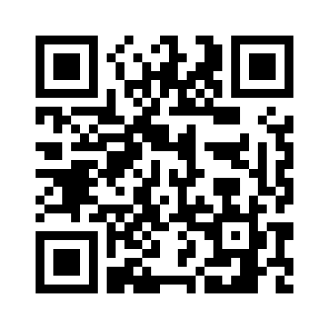
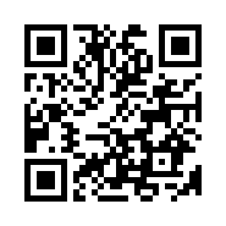
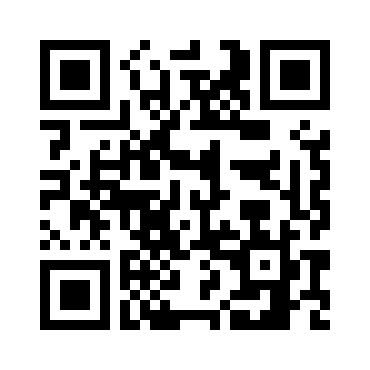

## Links zu den Seiten

Hier findest du die QR-Codes zu den einzelnen Stationen:

### [1. Station – P&R-Parkplatz](parkplatz)

**PIN:** 2025

### [2. Station – Sitzbank](bank)

**PIN:** 2608

### [3. Station – Kreuzung](kreuzung)

**PIN:** 0021

### [4. Station – Aussichtsturm](turm)

**PIN:** 1842

