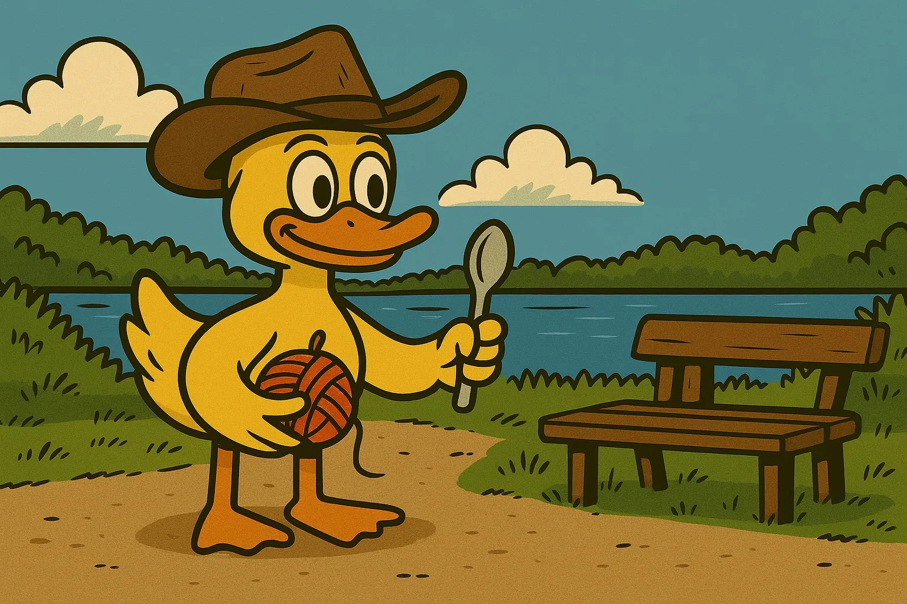

Herzlichen Glückwunsch zu eurem ersten gefundenen Geocache!
Jetzt kommt etwas Bewegung ins Spiel mit der _Kleiderkette_.
Wenn ihr die Aufgabe meistert, erhaltet ihr den nächsten Code.

{: style="border-radius: 16px;" }



<html>
    

        <h3>
            <a href="">Nächste Station</a>
        </h3>
        
    

    
    

</html>
