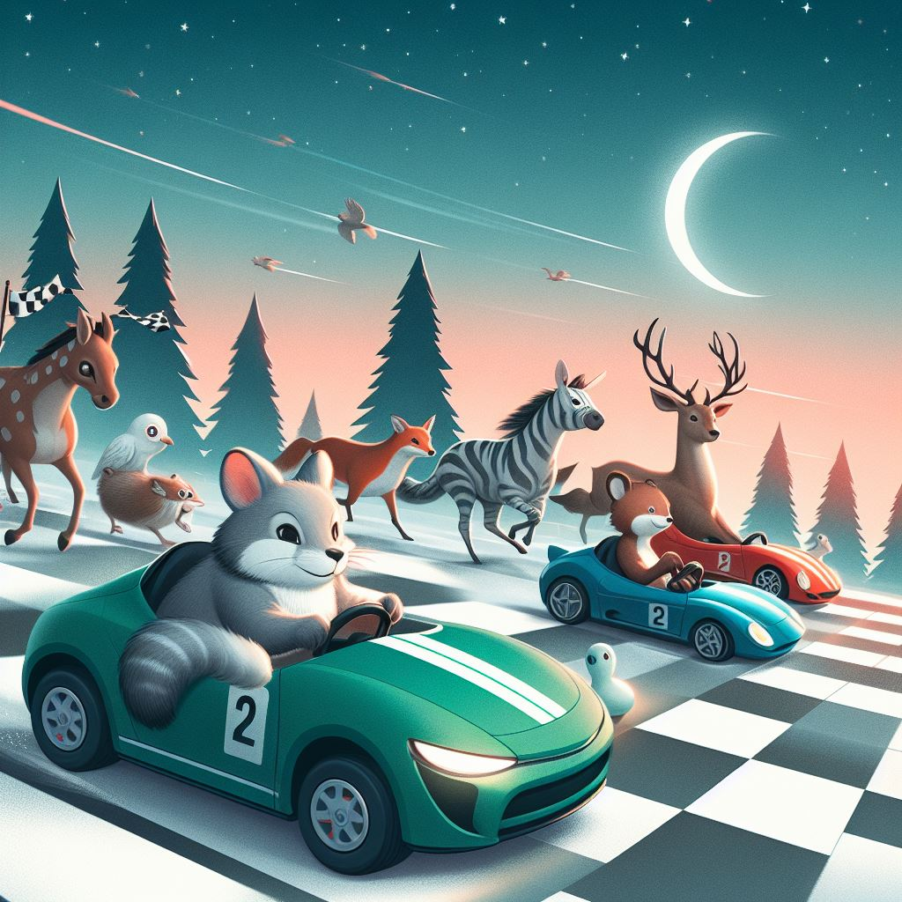

Willkommen am Start der ersten Fümmelser Geocache-Rallye!
Findet ihr alle Schätze im Ort?
Und wer wird der schnellste sein?

Die Regeln unseres Wettstreites sind:

- Jede Gruppe muss 5 Geocaches in Fümmelse finden.
- Jeder gefundene Geocache ist ein QR-Code, der euch zu einer Webseite führt.
- Diese liefert euch einen Buchstaben des Lösungswortes, den ihr euch merken müsst.
- Außerdem zeigt euch die Webseite den Weg zum nächsten Geocache.
- Die Gruppe, die als erstes alle 5 Geocaches gefunden hat und mit dem Lösungswort an den Start zurückkehrt, hat gewonnen.

Und hier ist euer erstes Ziel:

| Gruppe | Koordinaten                                                                                 |
| ------ | ------------------------------------------------------------------------------------------- |
| Rot    | [(52.15983, 10.48072)](https://www.google.com/maps/search/?api=1&query=52.15983%2C10.48072) |
| Grün   | [(52.16159, 10.48642)](https://www.google.com/maps/search/?api=1&query=52.16159%2C10.48642) |
| Blau   | [(52.16009, 10.47561)](https://www.google.com/maps/search/?api=1&query=52.16009%2C10.47561) |
