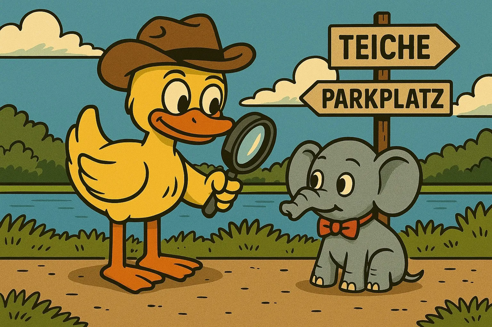

Na, habt ihr die Umgebung an den Teichen schon ein wenig erkundet?
Passend dazu gibt es für den nächsten Code eine spannende Suchaufgabe.

{: style="border-radius: 16px;" }



<html>
    

        <h3>
            <a href="">Nächste Station</a>
        </h3>
        
    

    
    

</html>
