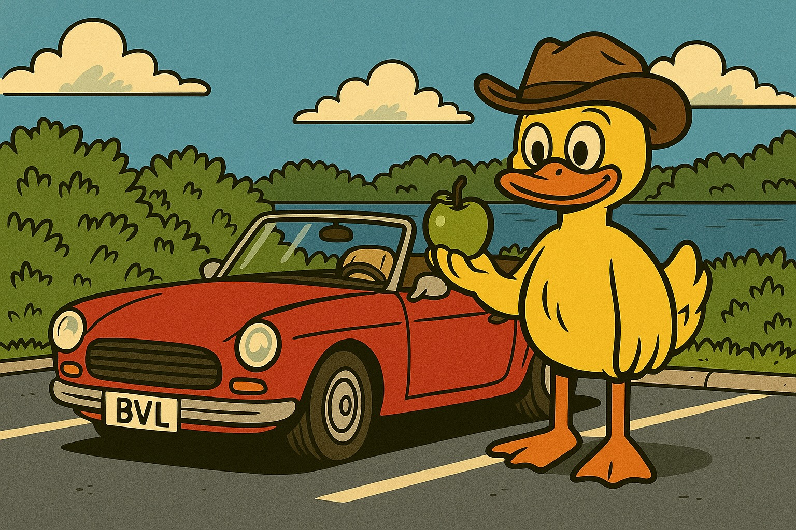

Guten Morgen und herzlich willkommen zu unserer gemeinsamen Geocaching-Tour rund um die Riddagshausener Teiche!

Bevor ihr von uns den Code für die ersten Koordinaten erhaltet, ist euer Wissen zum BVL gefragt.
Wir wünschen euch viel Erfolg und vor allem ganz viel Spaß!

{: style="border-radius: 16px;" }



<html>
    

        <h3>
            <a href="">Nächste Station</a>
        </h3>
        
    

    
    

</html>
